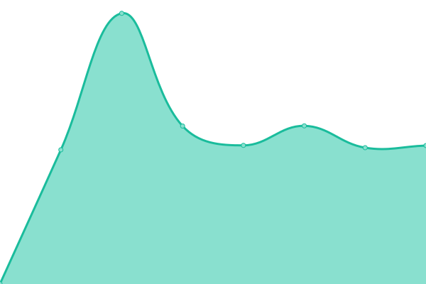
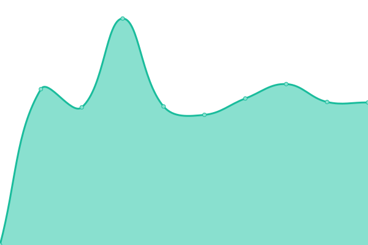
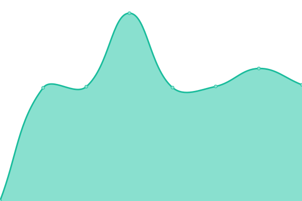

# [📈 Live Status](https://upptime.github.io/upptime): <!--live status--> **🟧 Partial outage**

This repository contains the open-source uptime monitor and status page for [Upptime](https://upptime.js.org), powered by [Upptime](https://github.com/upptime/upptime).

With [Upptime](https://upptime.js.org), you can get your own unlimited and free uptime monitor and status page, powered entirely by a GitHub repository. We use [Issues](https://github.com/upptime/upptime/issues) as incident reports, [Actions](https://github.com/diegominetti/upptime/actions) as uptime monitors, and [Pages](https://upptime.github.io/upptime) for the status page.

<!--start: status pages-->
<!-- This summary is generated by Upptime (https://github.com/upptime/upptime) -->
<!-- Do not edit this manually, your changes will be overwritten -->
<!-- prettier-ignore -->
| URL | Status | History | Response Time | Uptime |
| --- | ------ | ------- | ------------- | ------ |
|  [FewLines](https://www.fewlines.com.ar) | 🟩 Up | [few-lines.yml](https://github.com/DiegoMinetti/upptime/commits/HEAD/history/few-lines.yml) | 

 913ms
     
 | 

<a href="https://diegominetti.github.io/upptime/history/few-lines">100.00%</a>
    

|  [Crovara](https://crovara.fewlines.com.ar) | 🟩 Up | [crovara.yml](https://github.com/DiegoMinetti/upptime/commits/HEAD/history/crovara.yml) | 

 1016ms
     
 | 

<a href="https://diegominetti.github.io/upptime/history/crovara">99.45%</a>
    

|  [CrovaraLafe](https://crovaralafe.fewlines.com.ar) | 🟩 Up | [crovara-lafe.yml](https://github.com/DiegoMinetti/upptime/commits/HEAD/history/crovara-lafe.yml) | 

 1003ms
     
 | 

<a href="https://diegominetti.github.io/upptime/history/crovara-lafe">99.84%</a>
    

|  [Dintec](https://dintec.fewlines.com.ar) | 🟩 Up | [dintec.yml](https://github.com/DiegoMinetti/upptime/commits/HEAD/history/dintec.yml) | 

 975ms
     
 | 

<a href="https://diegominetti.github.io/upptime/history/dintec">100.00%</a>
    

|  [Fauval 1](https://fauval1.fewlines.com.ar) | 🟩 Up | [fauval-1.yml](https://github.com/DiegoMinetti/upptime/commits/HEAD/history/fauval-1.yml) | 

 941ms
     
 | 

<a href="https://diegominetti.github.io/upptime/history/fauval-1">100.00%</a>
    

|  [Fauval 2](https://fauval2.fewlines.com.ar) | 🟥 Down | [fauval-2.yml](https://github.com/DiegoMinetti/upptime/commits/HEAD/history/fauval-2.yml) | 

 0ms
     
 | 

<a href="https://diegominetti.github.io/upptime/history/fauval-2">0.00%</a>
    

|  [Fauval 3](https://fauval3.fewlines.com.ar) | 🟩 Up | [fauval-3.yml](https://github.com/DiegoMinetti/upptime/commits/HEAD/history/fauval-3.yml) | 

 1014ms
     
 | 

<a href="https://diegominetti.github.io/upptime/history/fauval-3">100.00%</a>
    

|  [Rogel](https://rogel.fewlines.com.ar) | 🟩 Up | [rogel.yml](https://github.com/DiegoMinetti/upptime/commits/HEAD/history/rogel.yml) | 

 914ms
     
 | 

<a href="https://diegominetti.github.io/upptime/history/rogel">100.00%</a>
    

|  [Roncati](https://roncati.fewlines.com.ar) | 🟩 Up | [roncati.yml](https://github.com/DiegoMinetti/upptime/commits/HEAD/history/roncati.yml) | 

 915ms
     
 | 

<a href="https://diegominetti.github.io/upptime/history/roncati">100.00%</a>
    

<!--end: status pages-->

[**Visit our status website →**](https://upptime.github.io/upptime)

## 📄 License

- Powered by: [Upptime](https://github.com/upptime/upptime)
- Code: [MIT](./LICENSE) © [Upptime](https://upptime.js.org)
- Data in the `./history` directory: [Open Database License](https://opendatacommons.org/licenses/odbl/1-0/)
